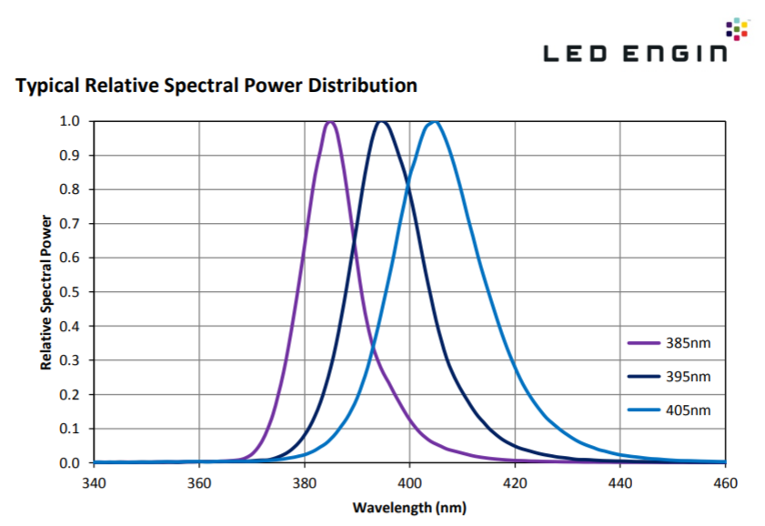
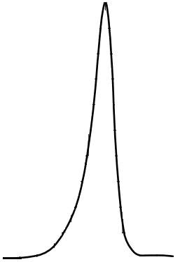
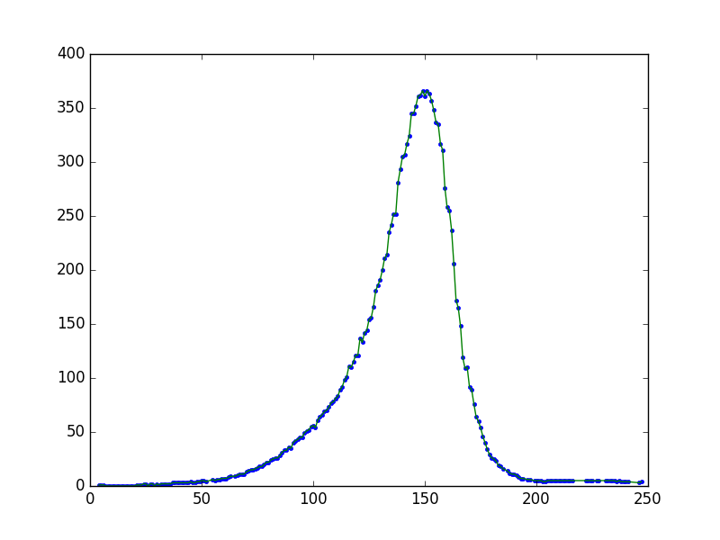

# image2data
Python library to extract data from image.

You should first pre-process the image in order to obtain only the plot you are interested in. For instance, in the following Figure, if you are only interested in the middle plot (395 nm), you should clean all the other data from the image.



So that it looks like the following Figure.


The function takes the image and coverts it to a gray scale image. The histogram of the resulting image is used to determine the color of the pixels in the plot, which are the ones we interested in. The algorithm then iterates over all the pixels in the image and returns the (x, y) coordinates of the 'darkest' pixels. The following figures show an example of an input image (left) and the plot of the output (right).

 

# How to use the module

The following code shows an example of how to import the module and use it to obtain the above plot.

```
import image2data
import matplotlib.pyplot as plt

data = "image2.jpg"
i2d = image2data.i2d(data)
x,y = i2d.process()
i2d.plot()
plt.plot(x,y)
```
